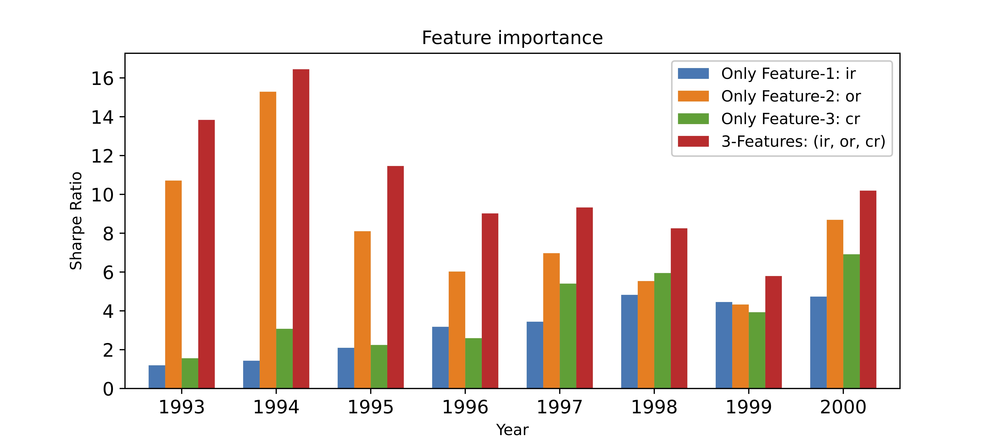

# [Forecasting directional movements of stock-prices for intraday trading using LSTM and random-forest](https://arxiv.org/abs/2004.10178)

**https://arxiv.org/abs/2004.10178** <br>
**Pushpendu Ghosh, Ariel Neufeld, Jajati K Sahoo**

We employ both random forests on the one hand and LSTM networks (more precisely CuDNNLSTM) on the other hand as training methodology to analyze their effectiveness in forecasting out-of-sample directional movements of constituent stocks of the S&amp;P 500, for intraday trading, from January 1993 till December 2018.

#### Requirements
```
pip install scikit-learn==0.20.4
pip install tensorflow==1.14.0
```

## Plots
We plot three important metrics to quantify the effectiveness of our model: [Intraday-240,3-LSTM.py](Intraday-240%2C3-LSTM.py) and [Intraday-240,3-RF.py](Intraday-240%2C3-RF.py), in the period January 1993 till December 2018. <br>
**Intraday LSTM**: [Intraday-240,3-LSTM.py](Intraday-240%2C3-LSTM.py) <br>
**Intraday RF**: [Intraday-240,3-RF.py](Intraday-240%2C3-RF.py) <br>
**Next Day LSTM, krauss18**: [NextDay-240,1-LSTM.py](NextDay-240%2C1-LSTM.py) [1] <br>
**Next Day RF, krauss17**: [NextDay-240,1-RF.py](NextDay-240%2C1-RF.py) [2] <br>

#### Cumulative Money growth (after transaction cost)
<div>


</div>

#### Average daily returns (after transaction cost)
<div>


</div>

#### Average (Annualized) Sharpe ratio (after transaction cost)
<div>


</div>

## Appendix

### Feature Importance
<div>


</div>
      This figure demonstrates the Sharpe ratio achieved when single features are used instead of 3-features for the same intraday trading strategy. It also tells which feature is important. <br>
      Result suggest <em><b>or</b></em> (returns from close price to next day open price) has the highest importance. This is justifiable by the fact it is the only feature which considers the latest available data (the trading day's open price) at the time of making the trading decision.

### LSTM hyperparameter tuning
<div>


</div>

### Benchmark against other LSTM architectures
<div>


</div>

We consider various new LSTM architectures but find that they are bulky and also not much effective in generating high results. GRU is a relatively simpler variation of LSTM, and generates reasonably good but slightly lesser returns than LSTM. <br>
In our experiments, we find the LSTM with 25 cells to be optimal in generating high results with agreeably less number of training variables.

References to the LSTM models:
1. Single Layer GRU: https://arxiv.org/abs/1412.3555
2. Stacked LSTM: https://www.sciencedirect.com/science/article/pii/S1877050920304865
3. Stacked Residual LSTM: https://arxiv.org/abs/1610.03098
  

## Acknowledgements
The first author gratefully acknowledges the NTU-India Connect Research Internship Programme which allowed him to carry out part of this research project while visiting the Nanyang Technological University, Singapore.<br>
The second author gratefully acknowledges financial support by the NAP Grant.

## References
[1] [Fischer, Thomas, and Christopher Krauss. "Deep learning with long short-term memory networks for financial market predictions." European Journal of Operational Research 270.2 (2018): 654-669.](https://www.econstor.eu/bitstream/10419/157808/1/886576210.pdf) <br>
[2] [Krauss, Christopher, Xuan Anh Do, and Nicolas Huck. "Deep neural networks, gradient-boosted trees, random forests: Statistical arbitrage on the S&P 500." European Journal of Operational Research 259.2 (2017): 689-702.](https://www.econstor.eu/bitstream/10419/130166/1/856307327.pdf)


