# [Forecasting directional movements of stock-prices for intraday trading using LSTM and random-forest](https://arxiv.org/abs/2004.10178)

**https://arxiv.org/abs/2004.10178** <br>
**Pushpendu Ghosh, Ariel Neufeld, Jajati K Sahoo**

We design a highly profitable trading stratergy and employ random forests and LSTM networks (more precisely CuDNNLSTM) to analyze their effectiveness in forecasting out-of-sample directional movements of constituent stocks of the S&amp;P 500, for intraday trading, from January 1993 till December 2018. 

#### Bibtex
```
@article{ghosh2021forecasting,
  title={Forecasting directional movements of stock prices for intraday trading using LSTM and random forests},
  author={Ghosh, Pushpendu and Neufeld, Ariel and Sahoo, Jajati Keshari},
  journal={Finance Research Letters},
  pages={102280},
  year={2021},
  publisher={Elsevier}
}
```

#### Requirements
```
pip install scikit-learn==0.20.4
pip install tensorflow==1.14.0
```

## Plots
We plot three important metrics to quantify the effectiveness of our model: [Intraday-240,3-LSTM.py](Intraday-240%2C3-LSTM.py) and [Intraday-240,3-RF.py](Intraday-240%2C3-RF.py), in the period January 1993 till December 2018. <br>
**Intraday LSTM**: [Intraday-240,3-LSTM.py](Intraday-240%2C3-LSTM.py) <br>
**Intraday RF**: [Intraday-240,3-RF.py](Intraday-240%2C3-RF.py) <br>
**Next Day LSTM, krauss18**: [NextDay-240,1-LSTM.py](NextDay-240%2C1-LSTM.py) [1] <br>
**Next Day RF, krauss17**: [NextDay-240,1-RF.py](NextDay-240%2C1-RF.py) [2] <br>

#### Cumulative Money growth (after transaction cost)
<div>
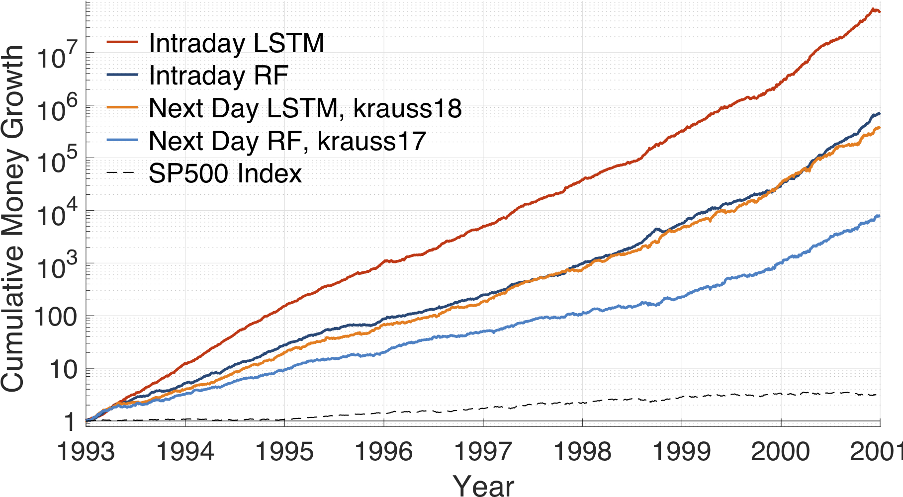
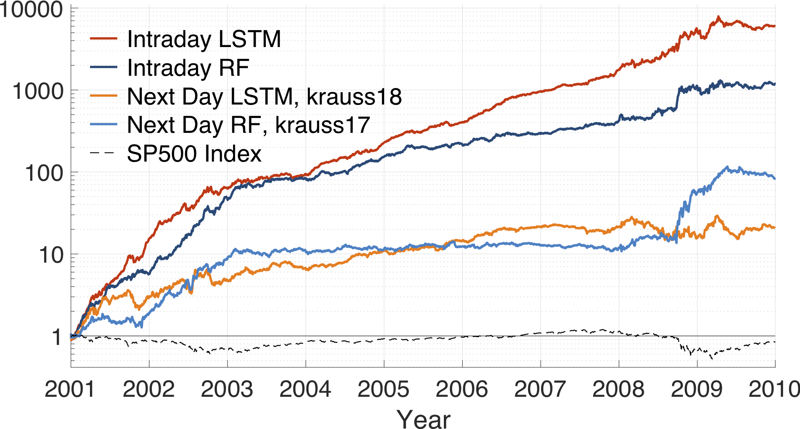
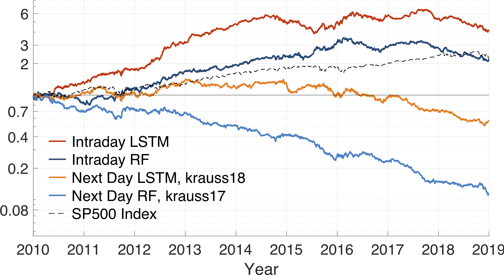
</div>

#### Average daily returns (after transaction cost)
<div>
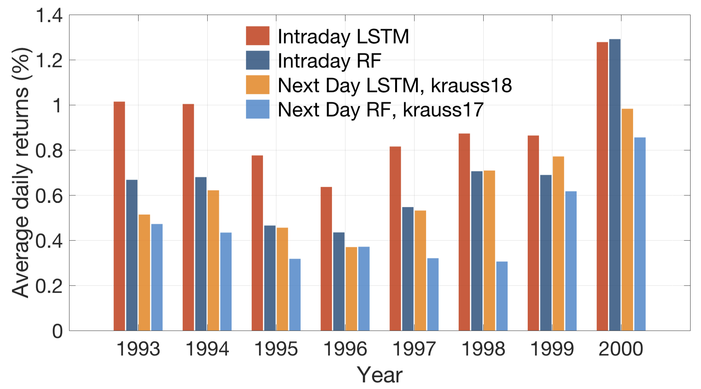
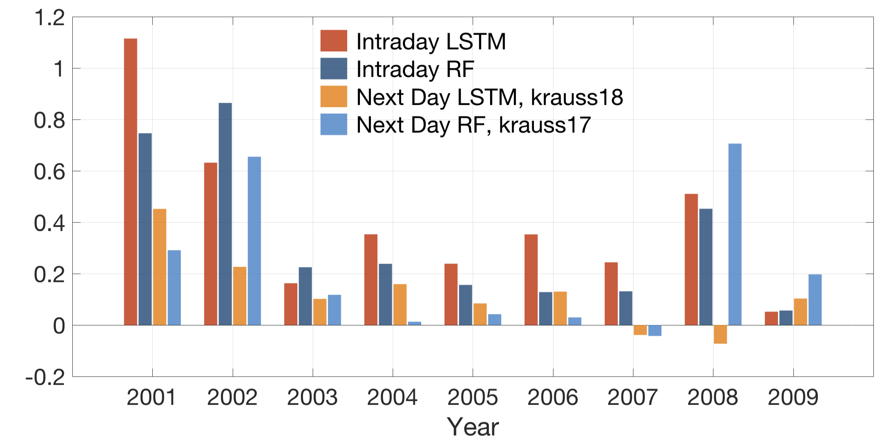
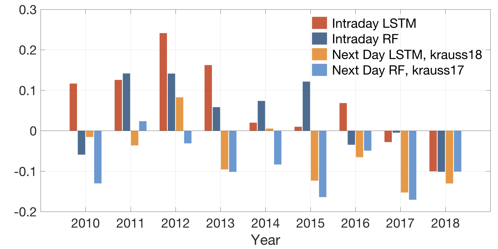
</div>

#### Average (Annualized) Sharpe ratio (after transaction cost)
<div>
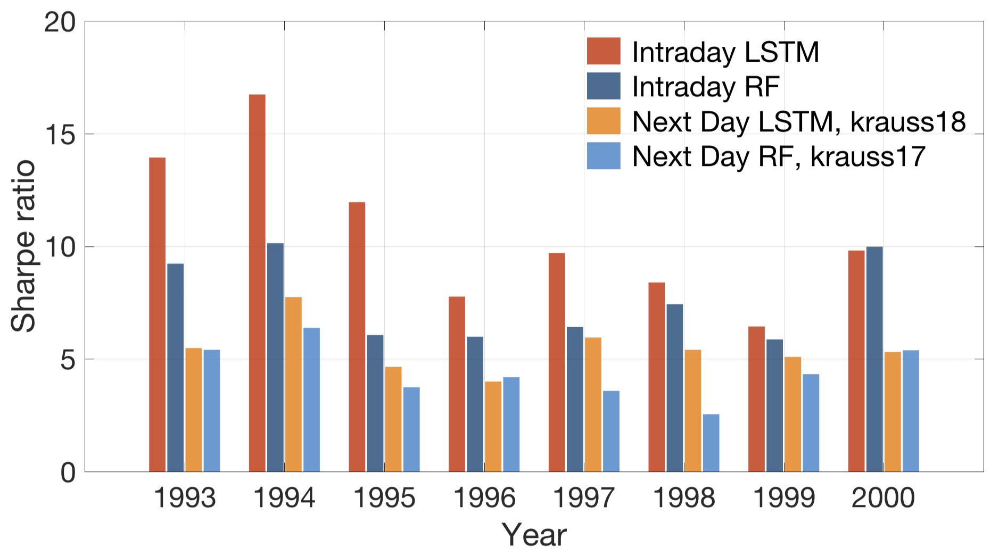
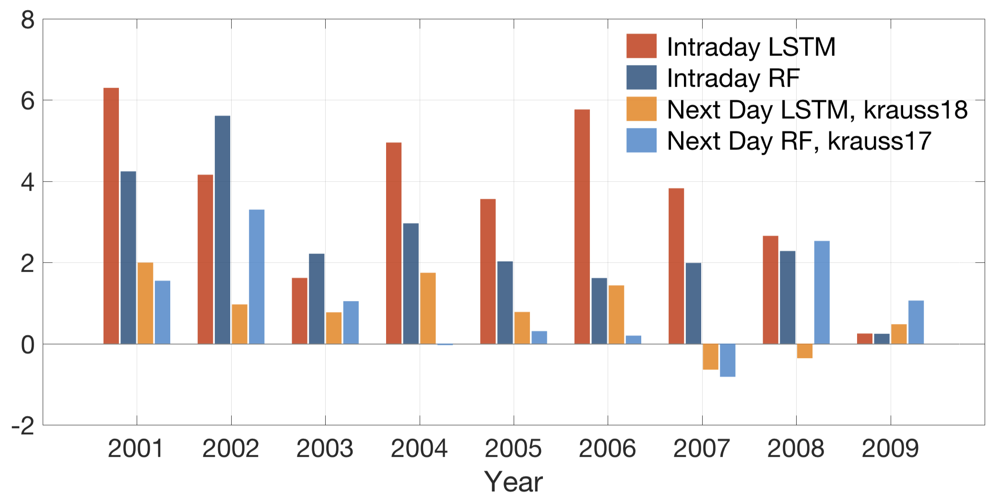
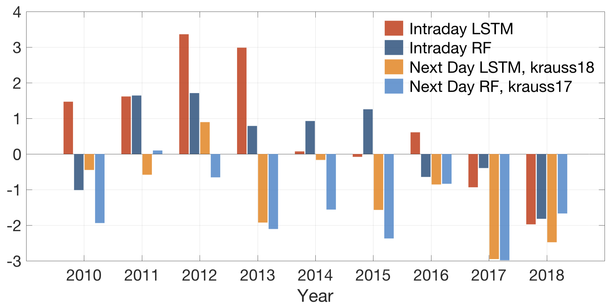
</div>

## Appendix

#### Feature Importance
<div>

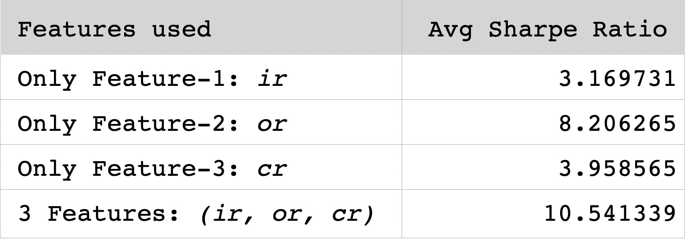
</div>
      This figure analyzes the Sharpe Ratio achieved when single features are used instead of our 3-features for the same intraday trading strategy. It hence analyzes which single feature is important. <br>
      The result suggest that <em><b>or</b></em> (returns from close price to next day open price) has the highest importance. This is justifiable by the fact that it is the only feature which considers the latest available data (the trading day's open price) at the time of making the trading decision. We also see that our 3-features setting achieves the highest Sharpe Ratio and hence outperforms each single feature.

#### LSTM hyperparameter tuning
<div>
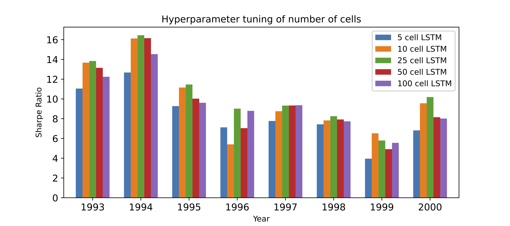
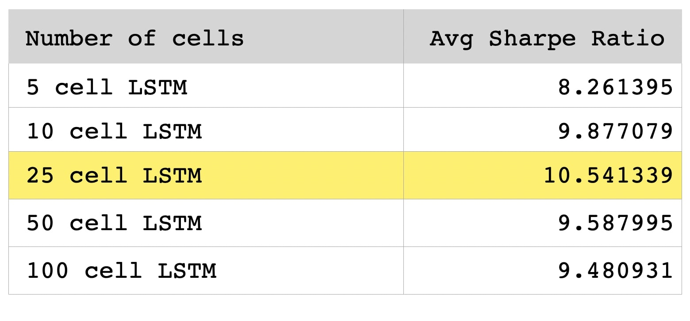
</div>
We see that the amount of 25 cells for our chosen LSTM architecture to be at least as good as other amounts between 5 and 100. We have chosen 25 cells also for the ease of comparison with Fischer & Krauss (2018)

#### Benchmark against other LSTM architectures
<div>
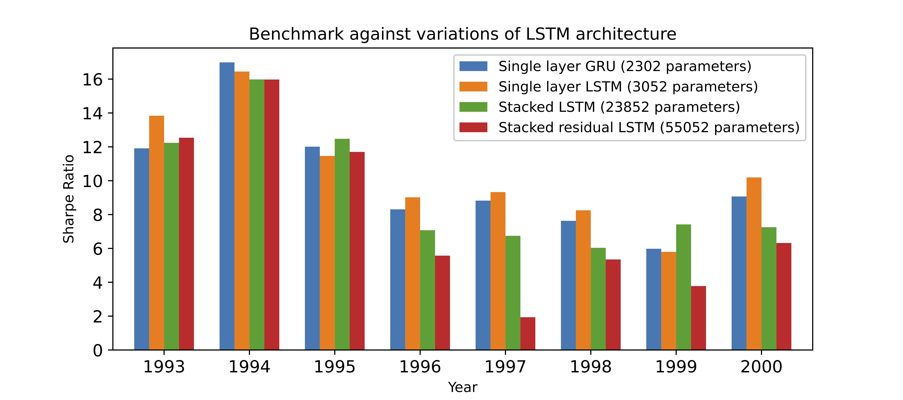
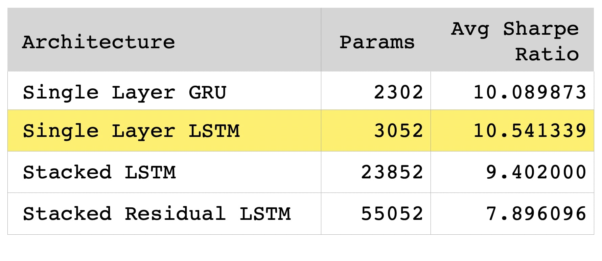
</div>

We consider various new LSTM architectures. Note that the other LSTM architectures involve much more parameters than the one we chose for our empirical study and do not achieve better results in terms of Sharpe Ratio. Moreover,  we also compare our LSTM architecture with GRU, which is a relatively simpler variation of LSTM, and see that it generates reasonably good but still slightly lower Sharpe ratio than our chosen  LSTM architecture.

References to the LSTM models:
1. Single Layer GRU: https://arxiv.org/abs/1412.3555
2. Stacked LSTM: https://www.sciencedirect.com/science/article/pii/S1877050920304865
3. Stacked Residual LSTM: https://arxiv.org/abs/1610.03098
  

## Acknowledgements
The first author gratefully acknowledges the NTU-India Connect Research Internship Programme which allowed him to carry out part of this research project while visiting the Nanyang Technological University, Singapore.<br>
The second author gratefully acknowledges financial support by his Nanyang Assistant Professorship Grant (NAP Grant) <em>Machine Learning based Algorithms in Finance and Insurance</em>.

## References
[1] [Fischer, Thomas, and Christopher Krauss. "Deep learning with long short-term memory networks for financial market predictions." European Journal of Operational Research 270.2 (2018): 654-669.](https://www.econstor.eu/bitstream/10419/157808/1/886576210.pdf) <br>
[2] [Krauss, Christopher, Xuan Anh Do, and Nicolas Huck. "Deep neural networks, gradient-boosted trees, random forests: Statistical arbitrage on the S&P 500." European Journal of Operational Research 259.2 (2017): 689-702.](https://www.econstor.eu/bitstream/10419/130166/1/856307327.pdf)


